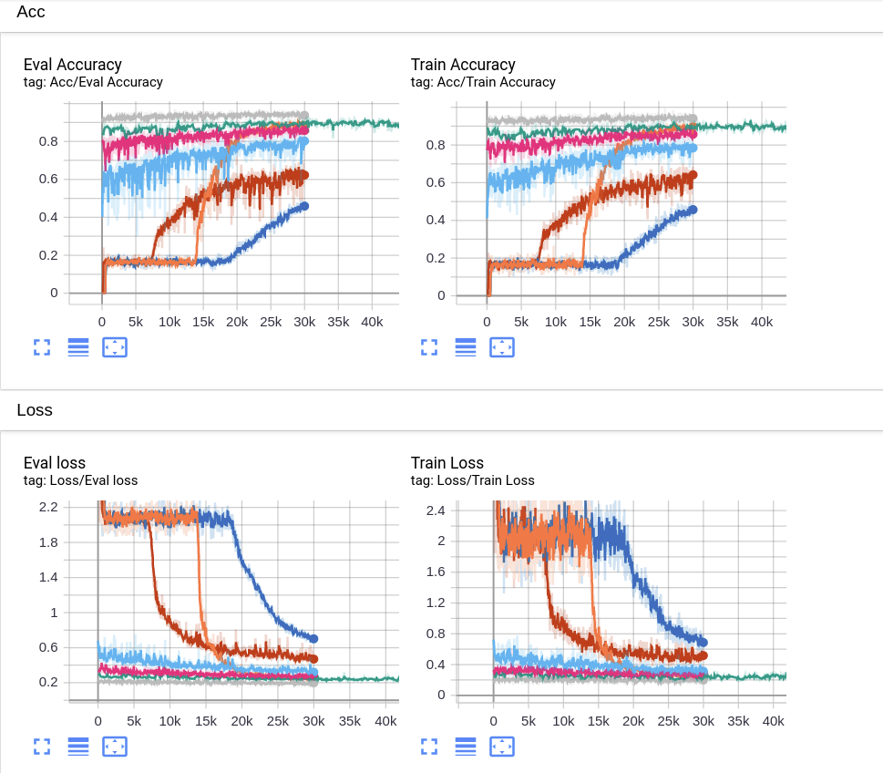

# Set-Transformer
My own implementation of ICML 2019 paper: **Set Transformer: A Framework for Attention-based Permutation-Invariant Neural Networks. **

- Official Pytorch implementation: [Github🔗juho-lee/set_transformer](https://github.com/juho-lee/set_transformer)  
- Paper hyperlink (arXiv): [Set Transformer: A Framework for Attention-based Permutation-Invariant Neural Networks. ](https://arxiv.org/abs/1810.00825)
- See reference: Vaswani et al (2017) *Attention is all you need*: [(arXiv🔗)](https://arxiv.org/abs/1706.03762)

---

### Simple Introduction & Results

I think this paper is easy to understand and implement. Yet I found it difficult to train, even for the simplest toy problem in which a max regression problem is formulated. The idea of this paper and the paper of the Transformer will be discussed in a blog of mine.

This is difficult to train, the author used 20000 epoch and a batch size of 128, Adam optimizer with initial_lr 1e-3, I really doubt it. Because in my implementation, it was not until the learning rate dropped to 6e-5 that the official MAB started to work. Mine is even harder, it took me 3 times of epochs. The results are shown as follows:

​		In this picture, only the orange curve is derived from the official implementation. The blue one is the first one that has a "look-able" result.
